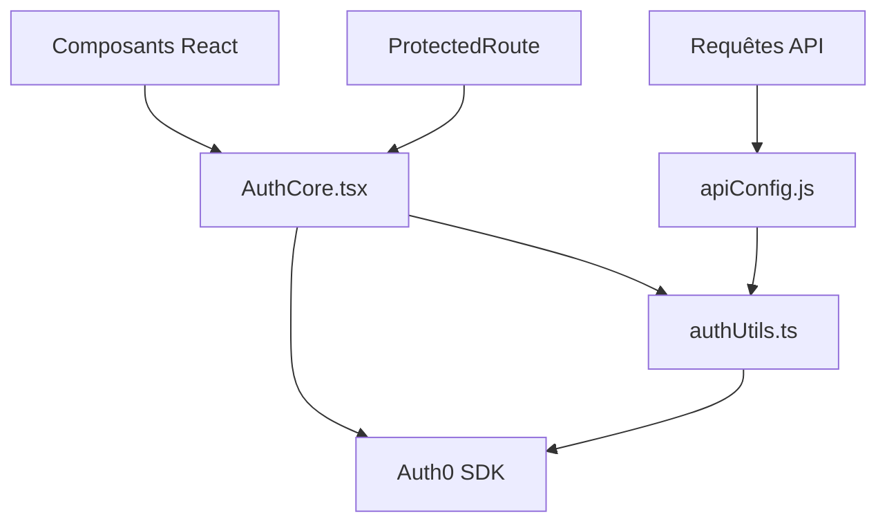

# Documentation du Système d'Authentification Velo-Altitude

## Vue d'ensemble

Le système d'authentification de Velo-Altitude utilise Auth0 comme fournisseur d'identité et implémente une approche sécurisée basée sur des JWT (JSON Web Tokens). Cette documentation détaille l'architecture, les flux d'authentification, la gestion des tokens, et la stratégie de test.

## Table des matières

1. [Architecture](#architecture)
2. [Flux d'authentification](#flux-dauthentification)
3. [Gestion des tokens](#gestion-des-tokens)
4. [Contrôle d'accès basé sur les rôles (RBAC)](#contrôle-daccès-basé-sur-les-rôles-rbac)
5. [Sécurité](#sécurité)
6. [Intégration avec l'API](#intégration-avec-lapi)
7. [Stratégie de test](#stratégie-de-test)
8. [Monitoring et alertes](#monitoring-et-alertes)
9. [Résolution des problèmes courants](#résolution-des-problèmes-courants)

## Architecture

Le système d'authentification s'articule autour des composants suivants :

- **AuthCore.tsx** : Point central du système d'authentification, intègre le SDK Auth0 et expose le contexte d'authentification.
- **authUtils.ts** : Utilitaires pour l'interaction avec Auth0, récupération des tokens, et vérification des rôles.
- **ProtectedRoute** : Composant React pour sécuriser les routes nécessitant une authentification.
- **apiConfig.js** : Configuration des intercepteurs pour attacher automatiquement les tokens aux requêtes API.

## Flux d'authentification

### Connexion

1. L'utilisateur clique sur le bouton de connexion
2. Auth0 est initialisé via le SDK
3. L'utilisateur est redirigé vers la page de connexion Auth0
4. Après authentification réussie, Auth0 redirige l'utilisateur vers l'application
5. Le SDK Auth0 traite la réponse et stocke les tokens en mémoire
6. L'application met à jour l'état de connexion et affiche le contenu approprié

### Vérification de l'authentification

Dès le chargement de l'application :

1. Le SDK Auth0 vérifie s'il existe une session valide
2. Si oui, les tokens sont récupérés et l'état d'authentification est mis à jour
3. Si non, l'utilisateur est considéré comme non authentifié

### Déconnexion

1. L'utilisateur clique sur le bouton de déconnexion
2. Le SDK Auth0 est appelé pour terminer la session
3. Les tokens sont supprimés
4. L'utilisateur est redirigé vers la page d'accueil ou de connexion

## Gestion des tokens

### Types de tokens

- **Access Token** : JWT utilisé pour accéder aux API protégées
- **ID Token** : JWT contenant les informations de l'utilisateur
- **Refresh Token** : Utilisé pour obtenir de nouveaux tokens sans reconnexion

### Cycle de vie des tokens

1. Les tokens sont stockés en mémoire par le SDK Auth0 (pas de stockage localStorage)
2. Les access tokens expirent après une durée configurée (par défaut : 10 heures)
3. Le SDK gère automatiquement le rafraîchissement des tokens expirés
4. Les intercepteurs API tentent de rafraîchir automatiquement les tokens en cas d'erreur 401

### Sécurité des tokens

- Les tokens ne sont jamais exposés au code JavaScript global
- Pas de stockage persistant des tokens (localStorage, sessionStorage, cookies)
- Utilisation du pattern singleton pour l'instance Auth0Client

## Contrôle d'accès basé sur les rôles (RBAC)

Velo-Altitude utilise un système RBAC pour limiter l'accès aux fonctionnalités :

- **Configuration des rôles** : Les rôles sont définis et assignés dans la console Auth0
- **Claims** : Les rôles sont transmis via le namespace personnalisé `https://velo-altitude.com/roles`
- **Vérification** : La fonction `hasRole` dans `authUtils.ts` vérifie les permissions

### Rôles disponibles

- **user** : Utilisateur standard (accès de base)
- **admin** : Administrateur (accès complet)
- **content_manager** : Gestionnaire de contenu

Voir [AUTH0_RBAC_CONFIGURATION.md](./AUTH0_RBAC_CONFIGURATION.md) pour plus de détails.

## Sécurité

### Bonnes pratiques implémentées

- **SPA sécurisée** : Utilisation du flux d'authentification recommandé pour les SPAs
- **Pas de tokens exposés** : Les tokens sont gérés par le SDK et jamais exposés
- **Renouvellement silencieux** : Refresh tokens gérés par le SDK sans intervention utilisateur
- **Gestion d'erreurs robuste** : Toutes les opérations d'authentification ont une gestion d'erreurs appropriée

### Considérations de sécurité

- Le système utilise PKCE (Proof Key for Code Exchange) pour prévenir les attaques d'interception
- Respect des règles CORS côté API
- Protection contre les attaques CSRF via les tokens Auth0

## Intégration avec l'API

### Intercepteurs automatiques

Les requêtes API sont automatiquement enrichies avec les tokens d'authentification via :

1. **apiConfig.js** : Configure les intercepteurs Axios
2. **prepareHeaders** : Fonction asynchrone qui récupère et attache les tokens
3. **Retry logic** : Logique pour réessayer les requêtes après refresh du token

### Gestion des erreurs

- **401 Unauthorized** : Tentative de rafraîchissement du token et réessai
- **403 Forbidden** : L'utilisateur n'a pas les permissions nécessaires
- **Autres erreurs** : Propagées à l'application pour traitement

## Stratégie de test

### Tests unitaires

Des tests unitaires couvrent :

- **authUtils.ts** : Tests des fonctions d'authentification avec mocks
- **ProtectedRoute** : Tests des comportements de redirection et d'accès
- **apiConfig.js** : Tests des intercepteurs de requêtes

### Tests d'intégration

L'environnement de test d'authentification (`/auth-test`) permet de valider :

- Connexion/déconnexion via Auth0
- Accès aux routes protégées
- Ajout automatique des tokens aux requêtes API
- Rafraîchissement des tokens expirés

### Tests E2E avec Cypress

Des commandes Cypress personnalisées facilitent les tests E2E :

- `loginViaAuth0` : Authentification via Auth0
- `visitProtected` : Visite d'une page protégée
- `simulateTokenExpiration` : Simulation d'expiration de token

## Monitoring et alertes

Le système d'authentification est surveillé via :

- **Logs Auth0** : Suivi des événements d'authentification
- **Monitoring applicatif** : Capture des erreurs d'authentification
- **Alertes** : Configuration d'alertes pour les échecs d'authentification répétés

### Métriques surveillées

- Taux d'échec de connexion
- Échecs de rafraîchissement de token
- Erreurs 401/403 dans les appels API
- Temps de réponse des opérations d'authentification

## Résolution des problèmes courants

### L'utilisateur ne peut pas se connecter

Vérifier :
- Configuration Auth0 correcte dans les variables d'environnement
- Redirection URLs configurées dans Auth0
- Logs Auth0 pour les messages d'erreur spécifiques

### Erreurs 401 dans les appels API

Possibles causes :
- Token expiré et échec du rafraîchissement
- Problème dans les intercepteurs API
- Problème de CORS côté serveur

### Accès refusé à des fonctionnalités

Vérifier :
- Attribution correcte des rôles dans Auth0
- Fonctionnement de `hasRole` avec les bons namespaces
- Format correct des claims dans le token
