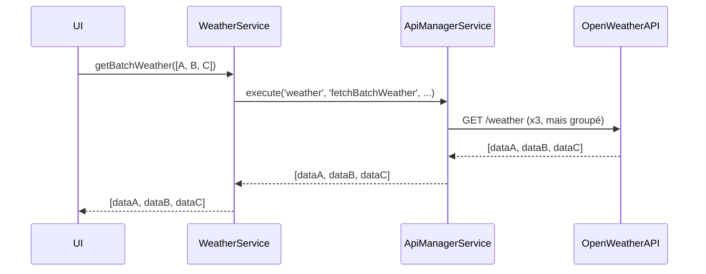

# API Request Optimization: Batching & Coalescing

## Objectif
Optimiser les appels API externes (Strava, OpenWeather, etc.) en éliminant les requêtes redondantes et en regroupant les appels similaires pour améliorer la performance et réduire la consommation de quota.

---

## 1. Centralisation via ApiManagerService
- Tous les appels API externes passent par `ApiManagerService`.
- Ce service gère le monitoring, le retry, le fallback, le quota, et maintenant le batching/coalescing.

---

## 2. Batching
- **Utilitaire** : `utils/request-batcher.js`
- **Principe** : Les requêtes similaires (ex: météo de plusieurs cols, activités Strava par date) sont regroupées en un seul appel batch côté service.
- **Exemple** :
  ```js
  // Obtenir la météo pour plusieurs points
  await weatherService.getBatchWeather([
    { lat: 45.9, lon: 6.8 },
    { lat: 44.1, lon: 7.0 }
  ]);
  ```

---

## 3. Coalescing
- **Utilitaire** : `utils/request-coalescer.js`
- **Principe** : Si deux requêtes identiques sont en vol, seule la première est envoyée, les autres attendent le même résultat.
- **Exemple** :
  ```js
  // Deux composants demandent la même météo au même moment
  await weatherService.getCurrentWeather(45.9, 6.8);
  // => une seule requête réelle
  ```

---

## 4. Intégration dans les services critiques
- `weather.service.js` : méthode `getBatchWeather()` et handler `fetchBatchWeather()`
- `strava.service.js` : méthode `getBatchActivities()` et handler `fetchBatchActivities()`
- Ces méthodes exploitent le batching/coalescing via `ApiManagerService`.

---

## 5. Instrumentation & Mesure
- Les métriques sont disponibles via `ApiManagerService.getServiceMetrics()`.
- Pour mesurer les gains :
  1. Compter le nombre total de requêtes API avant et après optimisation.
  2. Mesurer le temps de réponse moyen et la bande passante économisée.

---

## 6. Extension
- Pour tout nouveau service externe, il suffit d'utiliser `ApiManagerService.execute()` avec l'option `{ batch: true }` pour bénéficier du batching.
- Le coalescing est automatique pour toute requête identique.

---

## 7. Sécurité
- Les optimisations respectent les contrôles de quota, d'authentification et de sécurité déjà en place.

---

## 8. Exemple de schéma d'appel


---

## 9. Points d’extension
- Pour ajouter un nouveau type de batching/coalescing, ajouter une méthode batch côté service et l’enregistrer dans ApiManagerService.

---

## 10. Contact
Pour toute question ou extension, contacter l’équipe technique Velo-Altitude.
